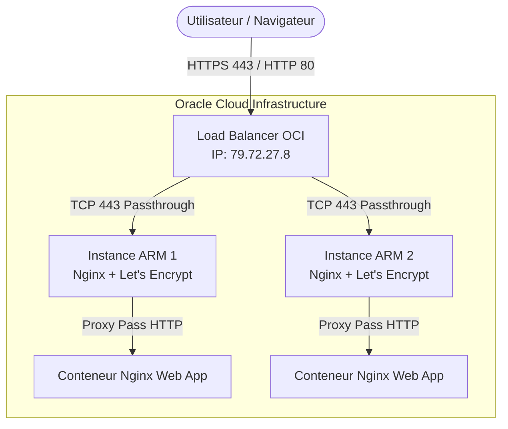

# Guide d'Exploitation - Projet Web (Always Free OCI)

## Architecture & Infrastructure

Le projet est déployé sur **Oracle Cloud Infrastructure (OCI)** en respectant strictement les quotas *Always Free*. L'architecture repose sur :
- **Un Load Balancer OCI flexible (10 Mbps)** avec une adresse IP publique unique (`79.72.27.8`), gérant :
  - Le trafic **HTTP (Port 80)** : routé vers les serveurs backend.
  - Le trafic **HTTPS / TCP Passthrough (Port 443)** : transmis de manière chiffrée directement vers les serveurs backend.
- **Deux Instances Compute ARM (VM.Standard.A1.Flex)** :
  - Chacune dotée d'une IP publique (pour la maintenance/SSH) et d'une IP privée.
  - Exécutant **Docker** et un conteneur **Nginx** servant de reverse-proxy local.
  - Gérant la terminaison SSL et les certificats **Let's Encrypt** pour le nom de domaine temporaire `testsiteem.duckdns.org` (en attendant un passage ultérieur sur un domaine `.fr`).

---

## Schéma d'Architecture



---

## Gestion des Certificats SSL (Let's Encrypt)

Les certificats SSL sont générés et gérés directement au niveau des instances web via **Certbot** et un proxy inverse Nginx local.

### Renouvellement automatique
* Une tâche **cron** est configurée sur chaque instance pour s'exécuter chaque jour à **04:00 du matin** :
  ```bash
  0 4 * * * certbot renew --quiet && docker compose -f /opt/projet-site/docker-compose.yml restart reverse-proxy
  ```
